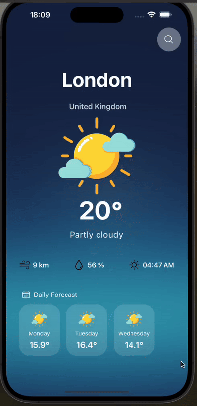

<h1>WeatherApp</h1>

This project is a weather application developed using React Native, Axios, and NativeWind. The app fetches weather data from an external API and provides users with real-time weather updates and forecasts.

<h2>Features</h2>

<ul>
        <li>Developed using React Native to create a modular and efficient application structure.</li>
        <li>Real-time weather data is fetched by integrating an external API using Axios.</li>
        <li>NativeWind is utilized for styling components, ensuring a modern and consistent design across the app.</li>
        <li>Responsive design provides a seamless experience across various screen sizes and orientations.</li>
</ul>

<h2>Screen Gif</h2>

